**SENG 438 - Software Testing, Reliability, and Quality**

**Lab. Report #3 – Code Coverage, Adequacy Criteria and Test Case Correlation**


<table>
  <tr>
   <td>Group #:
   </td>
   <td>
   </td>
  </tr>
  <tr>
   <td>Student Names:
   </td>
   <td>
   </td>
  </tr>
  <tr>
   <td>Rian Opperman
   </td>
   <td>30118288
   </td>
  </tr>
  <tr>
   <td>Tanish Datta
   </td>
   <td>30107335
   </td>
  </tr>
  <tr>
   <td>Arushi Gupta
   </td>
   <td>30121257
   </td>
  </tr>
  <tr>
   <td>Seniru Ruwanpura
   </td>
   <td>30122157
   </td>
  </tr>
</table>


# 1 Introduction

The primary purpose of this lab was to introduce us to the basic fundamentals of implementing white-box testing, and consolidate our understanding of the JUnit framework. While the previous lab where we originally created our test suite utilized black-box testing, where we simply used the JavaDoc to create our tests, here we were able to examine the actual code to create/amend the tests. Additionally, this lab was critical in allowing us to see the faults of our original test suite through our data-flow coverage calculations and the coverage tools available to us. In doing so, we also verified our unit tests, and were able to see how much of the unit testing (as well as how well) we completed, and see what else needed to be done. Then such changes were created to meet appropriate test coverage levels. The entire process gave us the ability to explore the software testing process much more in-depth by looking at as many possible avenues of the code as possible, and then making sure that we had a test created for that.


# 2 Manual data-flow coverage calculations for X and Y methods


## DataUtilities.calculateColumnTotal()


<p id="gdcalert1" ><span style="color: red; font-weight: bold">>>>>>  gd2md-html alert: inline image link here (to images/image1.png). Store image on your image server and adjust path/filename/extension if necessary. </span><br>(<a href="#">Back to top</a>)(<a href="#gdcalert2">Next alert</a>)<br><span style="color: red; font-weight: bold">>>>>> </span></p>


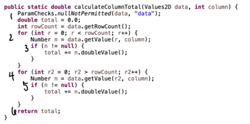


Data Flow Graph:


<p id="gdcalert2" ><span style="color: red; font-weight: bold">>>>>>  gd2md-html alert: inline image link here (to images/image2.png). Store image on your image server and adjust path/filename/extension if necessary. </span><br>(<a href="#">Back to top</a>)(<a href="#gdcalert3">Next alert</a>)<br><span style="color: red; font-weight: bold">>>>>> </span></p>


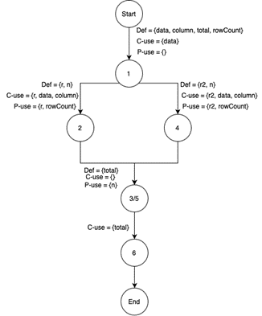


DU-pairs:

du(1, data) = {(1, 2), (1, 4)}

du(1, column) = {(1, 2), (1, 4)}

du(1, total) = {(1, 3), (1, 5)}

du(1, rowCount) = {(1, 2), (1, 4)}

du(2, r) = {(2, 2), (2, 2)}

du(2, n) = {(2, 3)}

DU-Sets:

	du(1, 2, data) = {(1, 2)}

du(1, 4, data) = {(1, 2, 3, 4)}

du(1, 2, column) = {(1, 2)}

du(1, 4, column) = {(1, 2, 3, 4)}

du(1, 3, total) = {(1, 2, 3)}

du(1, 5, total) = {(1, 2, 3, 4, 5)}

du(4, 5, rowCount) = {(1, 2)}

du(4, 5, rowCount) = {(1, 2, 3, 4)}

du(2, 2, r) = {(2)}

du(2, 3, n) = {(2, 3)}

Def-Use Table:


<table>
  <tr>
   <td><strong>Variable</strong>
   </td>
   <td><strong>Defined at</strong>
<p>
<strong>node (n)</strong>
   </td>
   <td><strong>dcu(v, n)</strong>
   </td>
   <td><strong>dpu (v, n)</strong>
   </td>
  </tr>
  <tr>
   <td>data
   </td>
   <td>1
   </td>
   <td>(1, 2), (1,4)
   </td>
   <td>∅
   </td>
  </tr>
  <tr>
   <td>Column
   </td>
   <td>1
   </td>
   <td>(1, 2), (1,4)
   </td>
   <td>∅
   </td>
  </tr>
  <tr>
   <td>total
   </td>
   <td>1
   </td>
   <td>∅
   </td>
   <td>∅
   </td>
  </tr>
  <tr>
   <td>rowCount
   </td>
   <td>1
   </td>
   <td>∅
   </td>
   <td>(1, 2), (1, 4)
   </td>
  </tr>
  <tr>
   <td>r
   </td>
   <td>2
   </td>
   <td>(2, 2)
   </td>
   <td>(2, 2)
   </td>
  </tr>
  <tr>
   <td>n
   </td>
   <td>2
   </td>
   <td>(2, 2)
   </td>
   <td>(2, 3)
   </td>
  </tr>
  <tr>
   <td>r2
   </td>
   <td>4
   </td>
   <td>(4, 4)
   </td>
   <td>(4, 5)
   </td>
  </tr>
</table>


<table>
  <tr>
   <td><strong>Tests</strong>
   </td>
   <td><strong>Pairs</strong>
   </td>
  </tr>
  <tr>
   <td>calculateColumnTotalEmpty()
   </td>
   <td>dcu(1), dpu{(1,2), (1, 3)}
   </td>
  </tr>
  <tr>
   <td>calculateColumnTotalForAllNullValue()
   </td>
   <td>dcu(1), dpu{(1,2), (1, 3)}
   </td>
  </tr>
  <tr>
   <td>calculateColumnTotalForAllZeroValue()
   </td>
   <td>dcu(1), dpu{(1,2), (1, 3)}
   </td>
  </tr>
  <tr>
   <td>calculateColumnTotalForNullValue()
   </td>
   <td>dcu(1), dpu{(1,2), (1, 3)}
   </td>
  </tr>
  <tr>
   <td>calculateColumnTotalForZeroValue()
   </td>
   <td>dcu(1), dpu{(1,2), (1, 3)}
   </td>
  </tr>
  <tr>
   <td>calculateColumnTotalNull()
   </td>
   <td>dcu(1), dpu{(1,2), (1, 3)}
   </td>
  </tr>
</table>


## **Feasible du-pairs: **du(1, 2, data), du(1, 4, data), du(1, 2, column), du(1, 4, column), du(1, 3, total), du(1, 5, total), du(4, 5, rowCount), du(4, 5, rowCount), du(2, 2, r), du(2, 3, n)

**Infeasible du-pair: **du(4, 4)

**du coverage** = (covered du - pairs)/(total du - infeasible du - pair) \*100%

**du coverage** = (10/11-1) \* 100% = 100%


## Range.contains()

```java

public static Range expand(Range range, double lowerMargin, double upperMargin) { // node 1


    ParamChecks.nullNotPermitted(range, "range");				     // node 2

    	double length = range.getLength();						     // node 3

    	double lower = range.getLowerBound() - length * lowerMargin;		     // node 4

    	double upper = range.getUpperBound() + length * upperMargin;		     // node 5

    	if (lower > upper) {								     // node 6

        		lower = lower / 2.0 + upper / 2.0;					     // node 7

        		upper = lower;								     // node 8

    	}

    	return new Range(lower, upper);						     // node 10

}

```

Data Flow Graph:


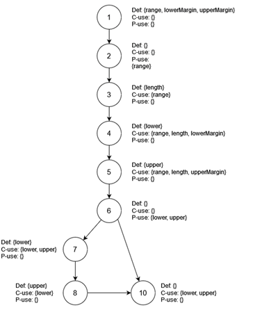


DU-pairs:


    du(1, range) = {(1, 2, 3), (1, 2, 3, 4), (1, 2, 3, 4, 5)}


    du(1, lowerMargin) = {(1, 2, 3, 4)}


    du(1, upperMargin) = {(1, 2, 3, 4, 5)}


    du(3, length) = {(3, 4), (3, 4, 5)}


    du(4, lower) = {(4, 5, 6), (4, 5, 6, 7), (4, 5, 6, 7, 10)}


    du(5, upper) = {(5, 6), (5, 6, 7), (5, 6, 7, 8), (5, 6, 10)}


    du(7, lower) = {(7, 8), (7, 8, 10)}


    du(8, upper) = {(8, 10)}

DU-sets:


    du(1, 3, range) = {(1, 2, 3)}


    du(1, 4, range) = {(1, 2, 3, 4)}


    du(1, 5, range) = {(1, 2, 3, 4, 5)}


    du(1, 4, lowerMargin) = {(1, 2, 3, 4)}


    du(3, 4, length) = {(3, 4)}


    du(3, 5, length) = {(3, 4, 5)}


    du(4, 6, lower) = {(4, 5, 6)}


    du(4, 7, lower) = {(4, 5, 6, 7)}


    du(4, 10, lower) = {(4, 5, 6, 7, 10)}


    du(5, 6, upper) = {(5, 6)}


    du(5, 7, upper) = {(5, 6, 7)}


    du(5, 8, upper) = {(5, 6, 7, 8)}


    du(5, 10, upper) = {(5, 6, 10)}


    du(7, 8, lower) = {(7, 8)}


    du(7, 10, lower) = {(7, 8, 10)}


    du(8, 10, upper) = {(8, 10)}

Def-Use Table:


<table>
  <tr>
   <td><strong>Variable</strong>
   </td>
   <td><strong>Defined at</strong>
<p>
<strong>node (n)</strong>
   </td>
   <td><strong>dcu(v, n)</strong>
   </td>
   <td><strong>dpu (v, n)</strong>
   </td>
  </tr>
  <tr>
   <td>range
   </td>
   <td>1
   </td>
   <td>{2, 3, 4, 5}
   </td>
   <td>∅
   </td>
  </tr>
  <tr>
   <td>lowerMargin
   </td>
   <td>1
   </td>
   <td>{4}
   </td>
   <td>∅
   </td>
  </tr>
  <tr>
   <td>upperMargin
   </td>
   <td>1
   </td>
   <td>{5}
   </td>
   <td>∅
   </td>
  </tr>
  <tr>
   <td>length
   </td>
   <td>3
   </td>
   <td>{4, 5}
   </td>
   <td>∅
   </td>
  </tr>
  <tr>
   <td>lower
   </td>
   <td>4
   </td>
   <td>{7}
   </td>
   <td>{(6, 7), (6, 10)}
   </td>
  </tr>
  <tr>
   <td>upper
   </td>
   <td>5
   </td>
   <td>{7}
   </td>
   <td>{(6, 7), (6, 10)}
   </td>
  </tr>
  <tr>
   <td>lower
   </td>
   <td>7
   </td>
   <td>{8, 10}
   </td>
   <td>∅
   </td>
  </tr>
  <tr>
   <td>upper
   </td>
   <td>8
   </td>
   <td>{10}
   </td>
   <td>∅
   </td>
  </tr>
</table>


Calculations:

TC1: &lt;range = null, lowerMargin = -0.5, upperMargin = -0.5>

TC2: &lt;range = null, lowerMargin = -0.5, upperMargin = 0.5>

TC3: &lt;range = null, lowerMargin = 0.5, upperMargin = -0.5>

TC4: &lt;range = null, lowerMargin = 0.5, upperMargin = 0.5>


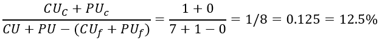


Collectively, TC1-4 only covers 1 node, Node 2, as it was designed to test the method throwing an exception when a null range was passed.

TC5: &lt;range =Range(-5, 5), lowerMargin = -0.5, upperMargin = -0.5>

TC6: &lt;range =Range(-5, 5), lowerMargin = -0.5, upperMargin = 0.5>

TC7: &lt;range =Range(-5, 5), lowerMargin = 0.5, upperMargin = -0.5>

TC8: &lt;range =Range(-5, 5), lowerMargin = 0.5, upperMargin = 0.5>

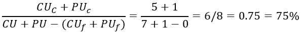


Collectively, TC5-8 covers 6 nodes, but unfortunately doesn’t cover a branch. To cover the missing branch one of the margins must be a greater negative number than the other, while both margins are still negative, that way we can get the lower and upper bound crossing over.

In total then, the previous tests cover 75% of the method, as TC1-4 are covered by TC5-8, but miss out on one branch of the method.


# 3 A detailed description of the testing strategy for the new unit test

For the testing strategy we first created Data Flow Graphs for each method in the classes Range and DataUtilities. We then used these graphs to help guide and design our test cases, along with developing extra cases to cover more of the nuances of said software.

	For example, we started out with making test cases that covered all possible paths, and from there expanded on those cases, creating more scenarios on if one variable was null or invalid and so forth. During this however we uncovered some unfeasible paths and as such could not make any tests for those methods.


# 4 A high level description of five selected test cases you have designed using coverage information, and how they have increased code coverage

**testShiftDeltaPos() and testShiftZeroCrossingDeltaNeg()**

The previous shift test cases in assignment 2 did not manage to cover all of the shift method, specifically it missed the branch where `allowZeroCrossing` was true and the else statement in `shiftWithNoZeroCrossing`. As such, we created two new test cases to reach these points to increase overall statement and branch coverage. More specifically, these test cases were designed by taking a look at the previous coverage metrics of the old test cases in eclipse by using EclEmma and by looking at the source code for the shift method, which we used to create a rudimentary DFG to help figure out which paths to cover and how to do so.

`testShiftDeltaPos` covered the else branch in `shiftWithNoZeroCrossing` as one of the bounds was 0, which allowed us to reach the else branch. `testShiftZeroCrossingDeltaNeg` covered the missing branch as it set `allowZeroCrossing` to true, meaning we could reach that branch.

**testIntersectBelowSpecifiedRange()**

This test case was created to increase the method metrics for the Range class. This particular test case tested the Range.Intersects(Double b0,Double b1) method. Specifically what these test cases did was check if the range that was specified (in this case range was from 6 to 10) intersected with the example range( -5 to 5). In this case, the method should’ve returned a boolean of false according to the javadoc.

Using EclEmma we found that it only covered a few of the branch and statement coverages for the method. Using this information, we created a DFG to ensure that more of the code was covered when testing this method. We then created 3 more test cases:

**testIntersectAtLowervSpecifiedRange()**

**testIntersectAboveSpecifiedRange()**

**testIntersectAtUpperSpecifiedRange()**

**dataUtilities.testEqualNulla() **

The main purpose of this test is to be able to check whether or not the code is reaching the specific branch that checks to see if the array,  double [][] a that is provided is null or not. This test helps with both statement and branch testing as the array provided it null. The code actually goes into the section where it checks for a == null and returns true or false depending on if array b is null or not. This test allowed for both branch and statement coverage to increase by 4%.

**dataUtilities.clonePositiveValues() **

The purpose of this test is to call clone on two normal and correct inputs. This test creates 100% for the clone method as the clone method has no error handling. If the wrong input such as null is sent through to the method, there is no error that occurs in the code. This is one of EclEmmas drawbacks as it does not identify that all aspects of the code are covered. This is only something you can manually determine.


# 5 A detailed report of the coverage achieved of each class and method

**Overall Coverage Range:**

Statement Coverage: 87.7

Branch Coverage: 87.8

Condition Coverage: 100

**Overall Coverage DataUtilities:**

Statement Coverage: 88.9

Branch Coverage: 78.1

Condition Coverage: 100

Range Instruction Coverage:

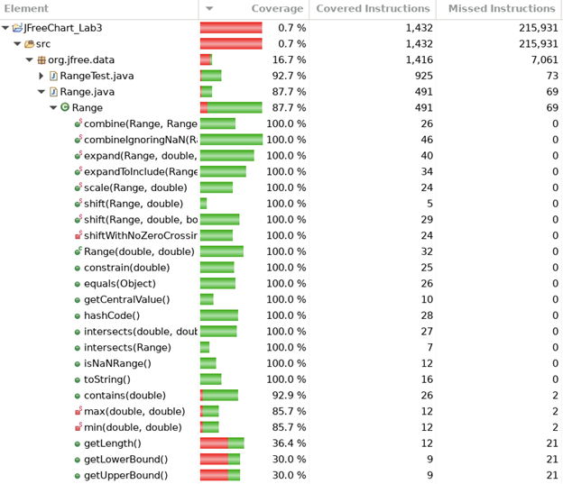


Range Branch Coverage:

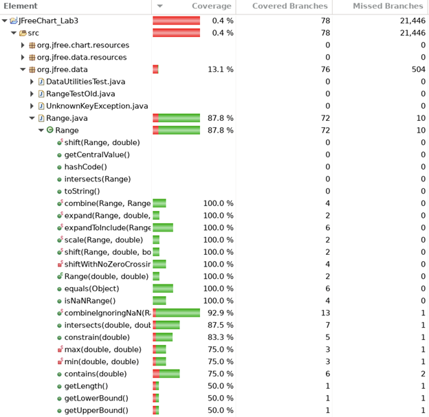


Range Method Coverage:


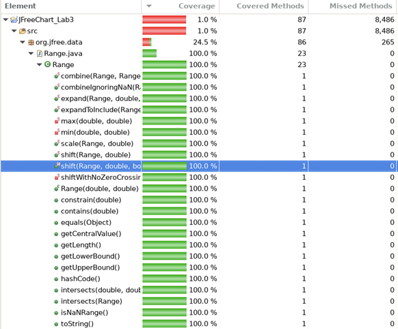


Range Total Coverage:
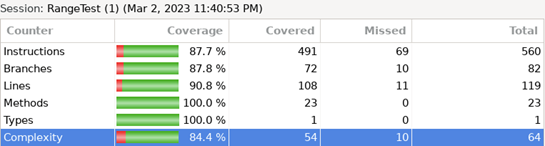


For instruction coverage we were not able to meet the 90% coverage criteria as some of the methods, mainly getLowerBound, getUpperBound, getLength, min and max, had infeasible paths that we were unable to cover. \
For lower bound, upper bound and length there are branches on if the lower bound is greater than the upper bound, and this is an infeasible path as this criteria is covered in the constructor of Range, which means we can never cover this branch. \
For min and max they are both private methods, and as such we are not able to cover them explicitly in our unit tests, only through testing other methods can we test them. This transitive property means that we cannot reliably test them, meaning they are in essence infeasible paths.

**DataUtilities**

Statement coverage:
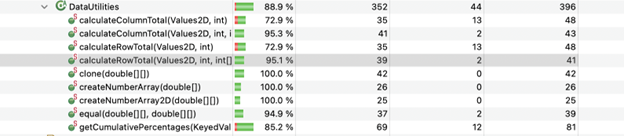


For statement coverage, we were not able to reach the coverage level of 90%. This is due to the methods, calculateColumnTotal, calculateRowTotal, equal, and getCumulativePercentages. All of these methods have unreachable blocks of code. Some of which can only be reached by changing the code to the proper statements so that the code values can be tested

Branch Coverage:
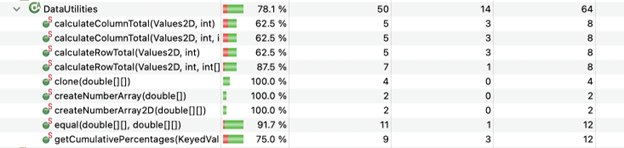


Method Coverage:
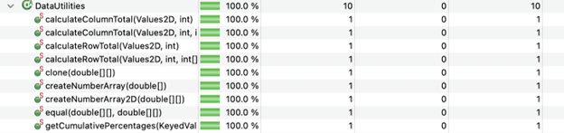


# 6 Pros and Cons of coverage tools used and Metrics you report

As recommended by course instructions and the overall scope of the tool in terms of it being able to deliver pretty much everything we were looking for in terms of analyzing our test coverage, the tool that was almost exclusively used for coverage was ECLEmma. The fact that ECLEmma was already integrated with our IDE (Eclipse) made it super easy to use and no time was taken to install it as this was already done. It additionally is able to fully integrate with the JUnit framework that we were using. The three types of coverage we were analyzing (statement, branch, condition) were effectively provided in ECLEmma through its detailed coverage methods, thus matching the deliverable needs of the lab.

On the other hand, ECLEmma had the tendency to generate false positives, such that we were told that code was not already tested when it already was. This also led to several unfeasible paths that prevented us from further improving our coverage metrics and in certain scenarios being slightly short of the metric we were targeting. ECLEmma further does not directly talk about condition or statement coverage, which meant we needed to adapt our strategy slightly, but this was a relatively minor fault of the tool.

We reported three key metrics. The first was statement coverage, which is the most simple measure of how much code was executed during testing and where the percentage of executable statements that were covered by our test suite were reported. This is an easy metric, but doesn’t really indicate whether code was tested thoroughly as it ignores code control flow. The second was branch coverage, which is far more detailed than statement coverage, and overall analyzed the test suite and code for the execution paths after decision statements being covered by test cases. However, this type of coverage was very difficult to achieve a high percentage in, and again can miss bugs related to control flow. The final coverage was method coverage, providing a measure of how many methods were covered in our test suite and if the method was called in the test suite. This is highly useful to uncover paths in the code that may have bugs that otherwise would be highly difficult to uncover, but is not a good indication of thorough code testing. Bugs that are also not in a particular method would also be overlooked by this coverage method exclusively.


# 7 A comparison on the advantages and disadvantages of requirements-based test generation and coverage-based test generation.

Requirements-based test generation and coverage-based test generation both serve the function of adequately testing the system for errors by creating test suites, but they each do it in separate aspects. With requirements testing we are trying to determine if the code produces the desired output, resulting in tests that generally serve the ultimate goal or purpose of the software. It is largely based around making sure the codebase is performing its functionality. This is a black-box based method, where you do not examine the source code and instead look at something like JavaDocs (which is what we did in Assignment 2). However, this method of test generation can leave many of the nuances or code uncovered (particularly with more obscure edge cases), leading to unforeseen bugs or issues down the line. Calculations are performed, and then based on how many tests you are supposed to create, you create tests that logically makes sense based on the documentation. This is what results in aspects potentially not being covered in the test suite.

 \
	With coverage-based testing the end goal is to try to cover all bases of the code, and make sure we know about any issues or potential problems in the code. This is a white-box based method, where source code alongside documentation can be analyzed. In general this method of code coverage is also easier to develop tests as we think more about edge cases and how to deal with them, than the more vague requirements based testing. You are able to actively ensure that your test coverage is as high as possible, meaning that you have examined the code with your tests as thoroughly as you possibly could have, while there is no such verification method with black-box testing. As such, many of the nuances of the code are covered, but the purpose or intended effect of said code is not ideally tested in these tests, nor can the software know which methods are most critical for the code functionality. Further, you need high knowledge about how the code works before implementing your tests, which is not present in black-box testing.

	Overall, both methods have their benefits, and a strategy (though time-wise not as feasible), where you implement the baseline for your testing through black-box testing, and then verify your work with white-box testing would ensure high coverage, as if original testing was not good enough, then future tests can be made based on the coverage level present in white-box.


# 8 A discussion on how the team work/effort was divided and managed

The team was divided into two groups, as per usual to conduct pair testing. One group (Rian and Tanish) worked on creating test cases to cover the Range class. The second group ( Seniru and Arushi) created tests to cover the DataUtilities class. This division of labour was based on the previous lab, as Rian and Tanish had already worked on Range, and Arushi and Seniru had already worked on DataUtilities, thus making a reasonable assumption that they would better understand how to conduct the data flow coverage calculations and improve the test suite at the necessary point in time.

Within each group, the same strategy was followed then divided the number method to be covered with each other. This meant that each individual was responsible for making sure each metrics such as statement, branch and method coverage met the minimum requirements. Before writing new test cases for methods, each member went through the javadoc for each of the classes and studied what each method does, later cross-referencing this with the code. After this, the two teams collaborated on their method’s data flow diagram to ensure proper coverage of the method was being tested. The other four elements of the manual data flow coverage calculations were split among the two to keep the workflow even. After doing so, each member wrote and tested the test cases to meet the minimum coverage requirements. Once rough work was done, the requirements were checked using EclEmma, a tool used to check code testing coverage. The group got together at the end, as there were several instances when the coverage requirements were not met, and through Discord, we looked at each other’s code and recommended fixes such that the coverage requirements could be met, or pointed out where the infeasible paths lay (meaning that coverage requirements could not be met marginally).


# 9 Any difficulties encountered, challenges overcome, and lessons learned from performing the lab

Overall, the manual data flow coverage calculation was a major difficulty that all of us encountered. As these were all new deliverables to us, we found it difficult to reconcile what we learnt in class with what needed to be done in the lab with the data flow graph creation, def-use sets, and defining all DU-paths and pairs. The latter was the most challenging, with a significant amount of time being taken to verify if our work was done correctly. We also were a bit confused on some issues with the data members of a class object, as they were defined in the class’s constructor, yet were used in the method, and as such, in the scope of the method we could not create a DU-pair for the data member. As such, most time was spent on this section of the lab.

Using ECLEmma was a bit of a challenge at first as we had never used it before, and we weren’t sure about how to see each coverage type, but, after a few TA and group consultations, this was pretty easily solved. One problem we encountered was running Junit tests on eclipse due to a version of hamcrest that was not compatible with Junit. We ended up using a version that was working from assignment 2.

Overall, we learnt a significant amount about how white-box testing works and how useful it is. As a result of the lab we are far more aware about how to work with data flow coverage calculations and importantly creating things like Data Flow graphs. While it’s obvious that testing tools such as ECLEmma do all the hard work for you in today’s day and age, to get behind how those calculations are generated is something that allows us to better understand the fundamentals of a good test suite, and thus generate a better test suite from the get go in future instances. Knowing how to verify this with ECLEmma is sure to come in handy as well.


# 10 Comments/feedback on the lab itself

In some aspects, this lab was easier to work on than the previous one (which is very much interlinked with this lab), and in others it was harder. As we already had exposure to JUnit and had an awareness of the overall classes and methods that needed to be tested, we were going in with some level of knowledge which made the initial comprehension of the lab much easier. The overall use of ECLEmma, apart from trying to figure out how to find the different coverage methods was highly productive for us.  \
	The biggest issue we held with the lab was the fact that we encountered some difficulties when trying to run the tests as we needed the hamcrest library JAR and it was not included in the lab’s git repo. In the future if the JAR was included in the repo it would be beneficial to students, but overall this was a minor issue for us.

